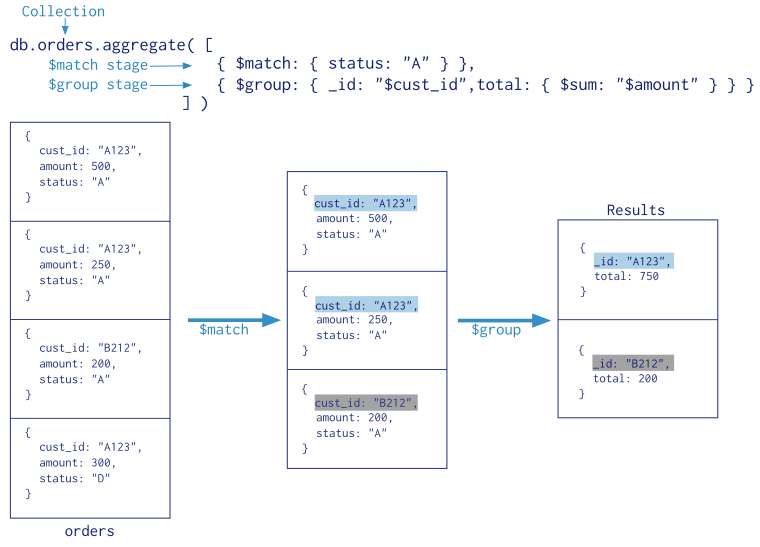

# MongoDB Aggregation

Recently, we learned how to do CRUD(Create, Read, Update & Delete) operations in MongoDB. This is of course very important to doing the basics of NoSQL in MongoDB. That being said, there are more significant things that MongoDB can do, especially in the realm of business analytics. And after all, this is a business analytics class :).


The Aggregation Pipeline is interesting from a data scientist's point of view because it opens up the possibility to simplify big data into metrics. These metrics allow us to understand, at a deep level, different business activities and uncover relationships that can transfer to business actions. 

All in all, we will be learning how to do data aggregation vai the Aggregation Pipeline and report a metric from MongoDB. 

Today we will be dealing with two different datasets. The first one is a partial set from my company, JoinIN - a SAAS product for universities to facilitate collaboration between students focused on entrepreneurship. The second dataset is located at this link - https://no.sqlzoo.net/wiki/Main_Page 


### What are aggregations?

From the MongoDB documentation:

> Aggregations operations process data records and return computed results.
> Aggregation operations group values from multiple documents together, and can
> perform variety of operations on the grouped data to return a single result.  
> Reference: https://docs.mongodb.com/manual/aggregation/

In short, aggregations operations allow developers to look at the massive data
in a simpler way. For example, in the JoinIN dataset, if I wanted to know how many students there are per major, aggregation pipeline would be the way to go! Aggregations allow developers to look at the data from
different angles.


## Quick MongoDB Refresher 
---
Remember that you can do READ operation like below:

```js
db.collection.find();

// simplest format of aggregation
// use count to count number
db.collection.find().count();

// With comparison query operator with greater than
db.collection.find( { key: { $gt: 'value' } } )

```
##### See here https://docs.mongodb.com/manual/reference/operator/query-comparison/ for more comparison operators

However, in doing you analysis, you might only want to project some fields. This is important for many reasons, but one of them is speed! In other words, return only the fields you need (think of this as the SELECT statement in SQL) instead of some big, unwieldy document from the collection.

**projection**. 

You can do projection like below:

```js
// simplest format of aggregation
db.colleciton.find('<query_criteria>', '<projection_field>')

// Example of projection on key1 and key2
db.collection.find( { key1: "value" }, { key1: 1, key2: 0 } )

```

You can find out more about MongoDB query in [this API
documentation](https://docs.mongodb.com/manual/reference/operator/query/) and on [projection here](https://docs.mongodb.com/manual/tutorial/project-fields-from-query-results/) 


---

## Aggregation Pipeline Mapping to SQL functions 


| SQL Terms  | `MongoDB Agg`   | Explanation  | Example |
| ---------- |:-------------:| -------------: |-------------:
| WHERE      | $match        | Filter documents                                   
| GROUP BY   | $group        | Group documents by value, summarize documents. Applies accumulator expression to each group
| HAVING     | $match        | Filters documents with respect to specific criteria that are passed on to next stage of pipeline
| SELECT     | $project      | Reshape documents, include                                    exclude fields, create new                                    fields    
| ORDER BY   | $sort         |Reorder document with respect to specific sort key
| SUM()      | $sum          | Returns sum of each group. Ignores non-numeric values
| COUNT()    | $sum          |    See above
| join       | $lookup       | Performs left outer join
| N/A     | $unwind        | Deconstructs an array field and returns a document for each array element | At Twitter you want to figure out who included the most user mentions in their tweet. In this case, user mentions is an array within a tweet
---

You can find out more about SQL to MongoDB query mapping in [this API
documentation](https://docs.mongodb.com/v3.0/reference/operator/aggregation/) 


So now that you have seen some of the functions that MongoDB does, lets review a few steps of the pipeline (or stages) with this graphic:




Above is a simple example of how we can use the aggregate pipeline to using the $match and $group pipelines.


#### Learn by example

Here, we will use a partial sample set from my company JoinIN. Below are the questions we will   answer using the aggregate pipeline and, when possible, describe each stage of the pipeline in SQL as well :). 

#### Some context about the dataset 

JoinIN is a complex dataset, with 12 collections (aka Tables). 

Here's a list of the collections :
+ activities
+ carts
+ categories
+ collaborates
+ companies
+ inboxes
+ listings
+ messages
+ pins
+ posts
+ users
+ works


Now that we have some context for this the database, lets tackle some questions regarding the data.

#### Questions

#### `1. How many total users are there? Only return the total.`

In SQL, one would achieve this by doing the following:
```sql
SELECT COUNT(*) AS count
FROM users
```
For this problem, using the aggregate function `COUNT()` does not require any grouping of the data.


However, in MongoDB, if we want to use the aggregate function `$sum` to count the number of all the documents in the user collection, we must also `$group` the inputs!

1. Group inputs and sum them
2. Return only the total number of documents in the User collection.
```js
// Number of users per category 
//filtering out nulls and empty values
   db.users.aggregate([
       { $group: { 
           _id: null, count: {$sum: 1} 
// _id refers to which fields to return, 
//and since we are just looking for the total number of 
//documents, we can just make it 'null'       
           } 
        }, 
        { $project: {
 // now we must use project in order to 
 //only return the count and not the _id           
            _id:0, count:1
            }
        }
    ])

//result: 
{ "count" : 450 }
```
### Key takeaway 1:
Different stages of the pipeline affect the nature of the inputs that pass down from one stage to the next or, in this case, from `$group` to `$project`.

---
#### `2.  How many total users are there per offer and what are the respesctive names associated with those offers ?`


In SQL, one could achieve this by doing the following (assume profile.name is just a `name` column in users table):
```sql
select offer, 
        string_agg(name, ',') as names, 
        COUNT(*) AS count
from users
group by offer

```
This is of course assuming the data is normalized for a SQL-esque table.

1. Identify the keywords - `total` (i.e. $sum) and `per` (i.e. $group).  
2. An enumerated list or set of the different groupings in MongoDB is always an array to which one adds to - i.e. `$addToSet` or `$push`. See  [here](https://docs.mongodb.com/manual/reference/operator/update/addToSet/) for more on $addToSet. 
3. If we wanted only unique names/values, then we would use `$addToSet`. However, in thise case, we want all the values so we will use [`$push`](https://docs.mongodb.com/manual/reference/operator/update/push/).


```js
// Number of users per category 
db.users.aggregate([
    { 
        $group: {  
        _id:'$offer', 
        names: {$push: '$profile.name'},
        count: {$sum: 1} 
        } 
    },
     { $sort: { 
        count: -1 }
    } 
])

//result:
{ "_id" : "Accounting Services", "names" : [ "Elizabeth Fournier" ], "count" : 1 }
{ "_id" : "Sales", "names" : [ "Rene Sanchez", "bernice johnson" ], "count" : 2 }
{ "_id" : null, "names" : [ "Carlos Torres",... "count" : 49 }
{ "_id" : "", "names" : [ "Richard (Songzhi)"...]}
...
```

*  Bonus!  Make sure to not include empty or null offers.
```js
db.users.aggregate([
    { $match: 
// similar to the WHERE clause in SQL, or, in the case of an aggregate, the HAVING clause    
        { $and: [{offer: {$ne: ""}}, 
                {offer: {$ne: null}}
        ]}
    }, 
    { $group: 
        {  
        _id:'$offer', 
        namesArray: {$push: '$profile.name'},
        count: {$sum: 1} 
        } 
    },
    { $sort: { 
        count: -1 }
    } 
])
{ "_id" : "Angel/Seed", 
"namesArray" : [ "Sonya Sepahban", "Sally Kang", .... ], 
"count" : 33 }
{ "_id" : "Other", 
"namesArray" : [ "Sydney Spraggins",  .... ],
 "count" : 24 }
```
### Key takeaway 2:
The `$group` stage allows us to not only use one of our accumulator operators - `$sum` - but also create new fields in that grouping such as `namesArray`. Moreover, the groupings of user documents in this case are organized by the `offer` field in the Users collection  

---


#### `3. Find the total amount every event has earned, the title of the event and the price of the event.`

1. While a `total` generally refers to `$sum`, here the attributes that refer to the attendees of an event and discount users are an array. To find the amount of elements in the arrays or the `total` length of the array, we have to use the `$size` operator ( we also did this in the last problem as well). 
2. Here, it's impportant to point out that each stage of the pipeline affects what is passed down. In this case, we want to `$project` different and/or new fields down to each stage of the pipeline. And as we pass from stage to another stage, we must always have the fields we want present in the final result in each stage of the pipeline in order to do so.

```js
db.listings.aggregate([
    { $project : {
// determine profitability by evaluating the number/size of paid_user array multiplied by the individual price
        profitability: {$multiply:[ 
            {"$size": "$paid_users"}, "$price" ]},
        price: 1,
        title: 1, 
        _id:0
        }
    },
    { $sort: {
        profitability:-1, price: -1
        }
    }
])


// results
{ "price" : 20, "title" : "ENTREPRENEURSHIP CLUB SILICON VALLEY TRIP OFFICIAL SIGN UP", "profitability" : 280, "AdiffD" : 14 }
{ "price" : 20, "title" : "Entrepreneurship Club Silicon Valley Trip", "profitability" : 100, "AdiffD" : 5 }
{ "price" : 20, "title" : "Startup Series:  \"Fundraising\"", "profitability" : 100, "AdiffD" : 5 }

```

### Key takeaway 3:
`$project` here can be used to create as many values as necessary in each stage of the pipeline such that later stages have access to said fields. Once the fields are created, each grouping of documents passed onto to the next stage can now be further manipulated by said instantiated field. Such is the case with `totalPrice` and `paid_users`. 

In addition, each stage of the pipeline builds on the last, so we cannot create a new variable in a stage and right away have it our disposal. This is why we need 3 $project stages here - first we need to create a new field for the sizes of the arrays, find the difference, then the total amount.  

####
####

---
#### `4.  How many total events has every user who has attended more than 1 event attended ? Sort by total events and then name.`

```js
// Number of total events attended by each user who has attended more than 1 event, sorted by total and then name.
db.users.aggregate([ 
// first identify values we want to project (i.e. SELECT in sql)     
    { $project: { 
        name: '$profile.name', 
        _id: 0, 
//the history column is just an array of objects, so we have to project a new field to hold the number of objects in that array        
        eventTot:{ $size: '$history'}
        } 
    }, 
// Now that we have the projected field we need, we can match (i.e. WHERE clause in SQL) eventTot sizes greater than or equal ($gte) to 1    
    { $match: { 
        eventTot: {$gt: 1} 
        } 
    },  
// sort by (ORDER BY) the first parameter, then the second. First paraemter is descending, and second is ascending i.e. alphabetically   
        { $sort: {
            eventTot:-1, 
            name: 1 
            }
        }
])
```
### Key takeaway 4:
Projecting is useful - as we will see later as well - to create fields and values that are currently no available to us in a form we need to return meaningful data. Since there is no quantitative value array length field, we must `$project` it such that we can filter out documents in this collection that do not `match` the parameter. 


---

#### `5. Count total number of events per category, list respective events, total number of attendees, and list it by the most profitable categories and respective total profits. Remove any false values.`

1. At a high level, we have `unwind` the events by category, and `group` the events by category.
2. Finally, we need to determine the profitability of those `group`, and create fields for the number of events and attendees.

```js
db.listings.aggregate([
// unwind events by categories field to create a copy of the event for each categories array value 
    { $unwind : "$categories"},
// then we must group those results by category 
//and $sum and $multiply in order to evaluate 
//the number of events, 
// attendees and profitability 
    { $group : {
        _id: "$categories", 
        events_array: { $push : "$title"}, 
        numberOfEvents: { $sum: 1 }, 
        numberOfAttendees:{
            $sum: {$size:'$listing_users'}
            },
        profitability: { $sum: { 
            $multiply: [  {$size: "$paid_users"}, "$price" ] } 
            }
        }
    }, 
// sort by created field profitability 
//to determine most profitable categories, descending
    { $sort: {profitability : -1}}
])

// results
{ "_id" : "General Business", 
"events_array" : [ "Build Your Dream team", "Early Stage Startup Success Factors at Pepperdine (West LA)"...],
 "numberOfEvents" : 30, 
 "numberOfAttendees" : 197, 
 "profitability" : 790 }

{ "_id" : "Angel/Seed", 
"events_array" : [ "Startegies for Building Your Dream Team and Fundraising", ... ],
 "numberOfEvents" : 10, 
 "numberOfAttendees" : 77, 
 "profitability" : 250 }

{ "_id" : "Other", 
"events_array" : [ "USNC LA Internship Meeting", "Mindful Hike", "Entrepreneurship Club Silicon Valley Trip",...], 
"numberOfEvents" : 20, "numberOfAttendees" : 53, 
"profitability" : 200 }
```

### Key takeaway 5:
`$unwind`  the array to create documents for each categories array element and then `$group` the results together to return the expected result.

---

#### `6. Calculate the percentage distribution of Pin categories in the Post document titled "Build a Dream Team".`
1. First determine the total earned per event
2. Group all events and sum up each document
3. The distribution of Pins in the Post collection is an array of ObjectIds (think of it like a foreign key) - this means that to discover the category for each ObjectId, we have to `$lookup` the value in the Pins collection. If `$lookup` is matched with a `foreignField of _id`, then it only accepts an `ObjectId`.

```js
db.posts.aggregate([
    {$match : {"_id" : ObjectId("57e413f200223203000d62d9")}},
    {$unwind : "$pin_array"}, 
// return a copy of post document for each 
//pin_array. At this point,
// each element, if found in   
    {$lookup : { 
         from: "pins", localField: "pin_array", 
         foreignField: "_id", as: "pin_docs"}},  
// remove unmatched Pin array elements
    {$match: {"pin_docs": {$ne: []}} }, 
// unwind out of array i.e. flatten it. Though 
//the array contains only one Pin document, 
//you must flatten the array to 
//return the right results    
    {$unwind : "$pin_docs"}, 
    {$unwind : "$pin_docs.pin_categories"},
// group all pins by category and normalize 
//categories to lower case, in case there are differences. Count number of categories present    
    {$group :{
        _id: { pin_cat: { 
                $toLower: "$pin_docs.pin_categories"}}, 
        records: { $push : "$pin_docs.title"}, 
        count: { $sum: 1 }}
    }, 
// project values from the group so that 
// we can easily collect the group into one document. 
// create temporary variable to do this 
    { $project: {
        tmp: {
            _id: '$_id', 
            records: '$records', 
            count: '$count'
        }
    }}, 
// now group all the inputs into one input to 
// get the the total number of inputs, 
// where the pin_category_group array 
// represents a grouping of pins
// based on category
    {$group: {
        _id: null, 
        total:{$sum: "$tmp.count"}, 
        pin_category_group: {$push: "$tmp"}}
    }, 
// unwind the pin_category_group group 
// to do the individual math that each
// category requires to discover the 
// distribution   
    {$unwind : "$pin_category_group"}, 
    {$project : {
        _id: "$pin_category_group._id", 
        records: "$pin_category_group.records", 
        count: "$pin_category_group.count", 
        total: 1, 
        percentage: {
            $multiply: [
            { $divide: 
                [ "$pin_category_group.count", 
                "$total"] 
            }, 100]
            } 
        }
    } 
])

// results
{ "_id" : { "pin_cat" : "other" },
"total" : 7, "records" : [ "Teams deck" ],
"count" : 1, 
"percentage" : 14.285714285714285 }

{ "_id" : { "pin_cat" : "human resources" }, 
"total" : 7, 
"records" : [ "Recruiting Strategies for Startups", "The 5 Key Dynamics That Make A Great Team",
"The 5 Key Dynamics That Make A Great Team", "4 Traits to Look for When Hiring Remote Workers (UpWork)",
"Federal Court Blocks New Overtime Rule (By Littler, 11/23/16)", "2-23-17" ],
 "count" : 6, "percentage" : 85.71428571428571 }
```

### Key takeaway 6:
Given that the pin_array is a list of ObjectIds (excluding edge cases), we can use `$lookup` to discover the each pin's category and then determine the category distribution of pins within the specified Post document. 
`Note` - it is good to think about the relationship between `unwinding` arrays to look at inputs and respective fields individually as well as `grouping` them to create aggregate field values.

---


## Overview and beyond

1. Aggregation pipeline is a powerful tool for doing some analytics on your data
2. Each stage of pipeline changes the structure of the inputs past through it
3. While most any stage can be used anywhere, some stages can only occur at certain points and are better if you [use earlier](https://docs.mongodb.com/manual/core/aggregation-pipeline/). For example, [`$geoNear`](https://docs.mongodb.com/manual/reference/operator/aggregation/geoNear/) (which we might discuss next lecture) can only appear as the first stage of the pipeline, while [`$out`](https://docs.mongodb.com/manual/reference/operator/aggregation/out/) can only appear as the last.
4. Remember to pass each field you need for every stage must be present in the stage preceding it.

Some other links:
[Analytics in MongDB](https://www.slideshare.net/mixmax99/mongodb-32-analytics), [MongoDB Aggregation Pipeline](https://www.slideshare.net/JasonTerpko/mongodb-aggregation-pipeline-94588376), [SQL to MongoDB Comparison](https://docs.mongodb.com/manual/reference/sql-aggregation-comparison/)

---

#### **if time permits...

## Time Series Analysis

#### `Count the number of events per quarter i.e. each 3 months.`

1. Project a date on listings i.e. Jan to March,  April to June, etc.
2. Concatenate or the `$concat` operator acts much like a `CASE` statement. Concatenates a set of conditions (`$cond`) for the projected `range` field, leaving only the field that is not empty as the project range. 
3. Determine the month of the date of the listing
4. Group by the range and `$sum`


```js
db.listings.aggregate([
    { $project: {
        "range": {
            $concat: [
                { $cond: [
                    { $and: [ 
                        { $gte: [{
                         $month: '$listing_date' }, 1]}, 
                        { $lte: [{ 
                         $month: '$listing_date' }, 3]}
                    ]}, "Months Jan - March", ""]
                }, 
                { $cond: [
                    { $and: [
                        { $gte: [{
                         $month: '$listing_date' }, 4]},
                        { $lte: [{ 
                         $month: '$listing_date' }, 6]}
                    ]}, "Months April - June", ""]
                },
                { $cond: [
                    { $and: [
                        { $gte: [{ 
                            $month: '$listing_date' },7]}, 
                        { $lte: [{ 
                            $month: '$listing_date' },9]}
                        ]}, "Months July - September", ""]
                },
                { $cond: [{ 
                    $gte: [{ 
                     $month: '$listing_date' }, 10]
                    }, "Months October - December", ""]
                }
            ]
        }}
    },
    { $group: {
        _id: '$range',count: {$sum: 1}}
    }
])

//result:
{ "_id" : "Months 1 - 3", "count" : 14 }
{ "_id" : "Months 3 - 6", "count" : 25 }
{ "_id" : "Months 6 - 9", "count" : 9 }
{ "_id" : "Months 9 - 12", "count" : 21 }
...
```


## Extra resources

There are a few other accumulator operator you may use like below:

| Name | Description |
|:--|:--|
| [$sum](https://docs.mongodb.com/manual/reference/operator/aggregation/sum/) | return a sum of numerical values. Ignore non-numeric values. |
| [$avg](https://docs.mongodb.com/manual/reference/operator/aggregation/avg/) | returns an average of numerical values. Ignore non-numeric values. |
| [$first](https://docs.mongodb.com/manual/reference/operator/aggregation/first/) | returns a value from the first document for each group. Order is only defined if the documents are in a defined order. |
| [$last](https://docs.mongodb.com/manual/reference/operator/aggregation/last/) | similar to above but returns last document. |
| [$max](https://docs.mongodb.com/manual/reference/operator/aggregation/max/) | returns the highest expression value for each group. |
| [$min](https://docs.mongodb.com/manual/reference/operator/aggregation/min/<Paste>) | similar to above but returns the lowest |
| [$push](https://docs.mongodb.com/manual/reference/operator/aggregation/push/) | return an array of expression values for each group. |
| [$addToSet](https://docs.mongodb.com/manual/reference/operator/aggregation/addToSet/) | returns an array of unique expression values for each group |
| [$stdDevPop](https://docs.mongodb.com/manual/reference/operator/aggregation/stdDevPop/) | returns the population standard deviation of the input values. |
| [$stdDevSamp](https://docs.mongodb.com/manual/reference/operator/aggregation/stdDevSamp/) | returns the sample standard deviation of the input values. |


